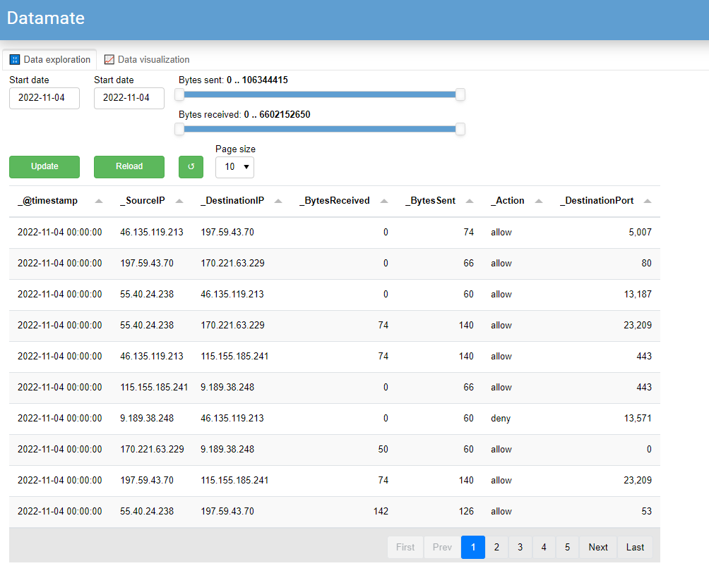
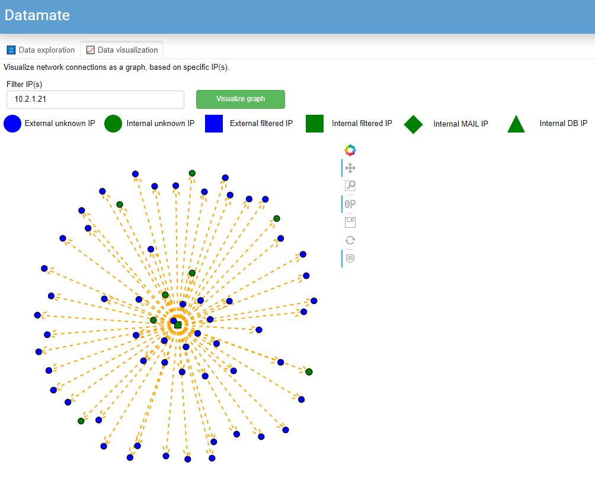
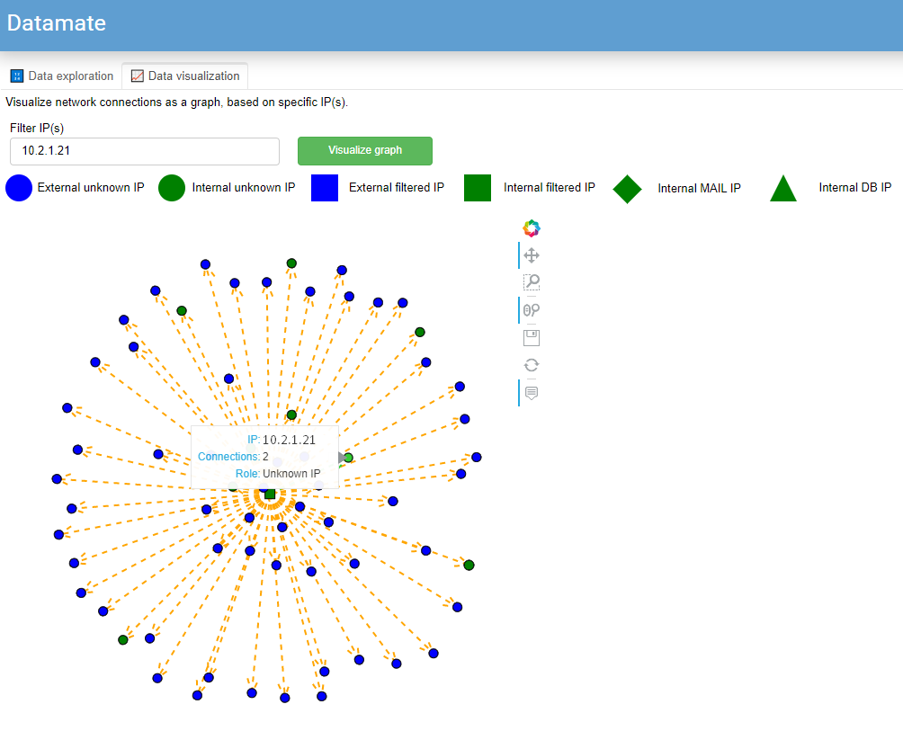

# Datamate (DM8)

- [About](#about)
- [Main feaures](#main-features)
    - [Data conversion](#data-conversion)
    - [Data visualization](#data-visualization)
- [Setup](#setup)
    - [Setup the data conversion part](#setup-the-data-conversion-part)
    - [Setup the data visualization part](#setup-the-data-visualization-part)
- [Usage](#usage)
    - [Use data conversion](#use-data-conversion)
    - [Use data visualization](#use-data-visualization)

## About

Datamate is a tool for security analysts to help performing data exfiltration analysis on large NetFlow/firewall data quickly and locally, without having to deploy complex infrastructure. 

## Main features

### Data conversion
Data conversion is Python script wrapped in a Docker image, which can be run as a Docker container.

In converts the raw data from JSON lines to Parqet.
### Data visualization

Data visualization allows the user to explore and filter the data to identify potentially malicious IP(s)
Using the identified IP(s), the user can view a graph concerning the filtered IP(s) to gain more insights. 

## Setup

### Setup the data conversion part

Before going into the details regarding the setup designated for this features, Docker Desktop should be installed and it can be found [here](https://www.docker.com/products/docker-desktop/)

Here are the required steps in order to setup a Docker container which will convert the raw data from JSON lines format to Parquet format.
1. Open Docker Desktop as admin
2. From Docker Desktop open `Settings`
3. From Settings go to `Resources` > `File sharing`
4. Within File sharing add the local folder where the raw data is stored
5. Open a terminal and go to the folder where the repository is located
6. Build the Docker image using the Dockerfile

    ```docker build -t data_converter .```
    
    Parameters:
    - `-t data_converter` - name the docker image (in this case "data_converter")

7. Run the Docker image as Docker container

    ```docker run -it --rm -v <local_folder_path>:<container_folder_path> --memory="16g" --memory-swap="32g" --cpus="6.0" --env-file datamate.env data_converter /bin/bash```

    Parameters:
    - `--it` - will create an interactive bash shell
    - `--rm` - will detele the docker container once the session is closed
    - `-v <local_folder_path>:<container_folder_path>` - the volume mounted
    - `--memory="16g"` - memory limit
    - `--memory-swap="32g"` - swap limit equal to memory plus swap ("-1" for unlimited swap)
    - `--cpus="6.0"` - number of CPUs
    - `--env-file datamate.env` - read a file of environment variables
    - `data_converter` - specify the Docker image (it can have also a tag `name:tag`)
    - `/bin/bash` - starts the bash shell

After following all the above steps, the following prompt will be seen in the terminal: `root@515e7f248656:/converter#` (the number will be different as is randomly generated ateach run)

### Setup the data visualization part

Here are the required steps in order to setup the data visualization part:
1. Install miniconda from [here](https://docs.conda.io/en/latest/miniconda.html) (needed to create virtual env to keep the dependencies isolated)
2. Open a miniconda terminal (it should start with the `base` env)
3. Go to the project location (where the repository is located), to have immediate access to environment.yml file
4. Run the following command to setup a conda env `conda env create --file environment.yml` (you can change the name of the env by editing environment.yml)

As far as the setup goes, all should be set in order to start using the tool.

## Usage

### Use data conversion

Now that the Docker container is running, the actual conversion can be started. The only thing needed is to run from terminal `python dask_json_to_parquet.py`.

The following messages will be seen during the execution, highlighting the performed steps:

```
24-02-2023, 09:03:50 Start converting
Create output folder if it doesn't exist
Initiate local cluster with 6 CPUs
Setup columns dtypes
Process data
Save to parquet
24-02-2023, 09:05:38 End converting
```

Depending on the amount of data, conversion can take some time and when is done, the Parquet file can be seen locally, in the `output` folder, created within `local_folder_path` provided.

### Use data visualization

At this point, data should be already converted into a parquet file and also the datamate environment set.

To launch the data visualization tool, the following needs to be done:
1. Before launching the tool, there is the option to add so called known servers to the config file `config.json`
```
"known_servers":{
    "10.250.10.15": "MAILSRV",
    "10.250.18.22": "DBSRV2",
    "10.250.10.50": "DBSRV1",
}
```
This will allow detailed visualization regarding the graph nodes.
Current supported server types:
- DB servers: it has to contain db within the string
- MAIL servers: it has to contain mail within the string 
3. From miniconda terminal, activate the environment using `conda activate datamate` (where `datamate` is the env name)
4. Run the command `python datamate.py --config config.json --datafile filepath_to_parquet_file` where the `config.json` is your config for the targeted data, although it can be a dedicated file, such as `config_customerA.json` and `filepath_to_parquet_file` points to your parquet file

The last command will launch the following view within the default browser:



The following filters can be used to isolate IP(s):
- Start date
- End date
- Bytes sent
- Bytes received

The following buttons can be used to update the data:
- Update: updates the table based on current filters
- Reload: reloads the data from zero and resets the filters
- Reset (↺): resets filters, without reloading the data

Page size can be used to change the amount of rows per page.
**Note:** Currently, only first 50 rows are displayed

The second tab, `Data visualization` can be used to generate a graph around filtered IP(s)



As it can be seen, the custom legend is activated, to better express known nodes within the network (usually internal IPs)
Also each node provides additional info when hovering:
- IP
- Amount of connections within the network
- Role




